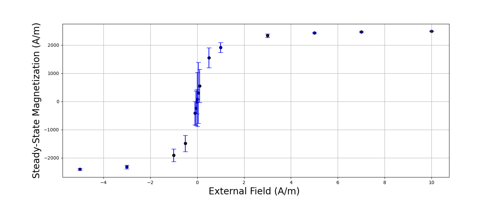
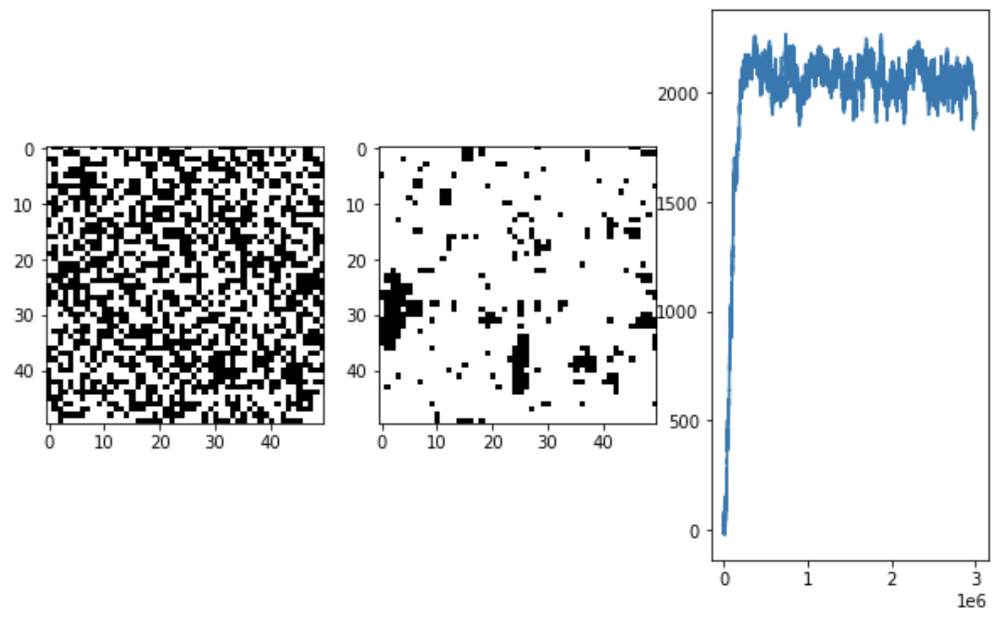
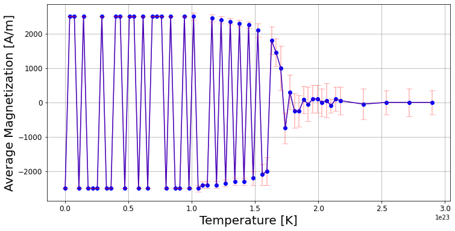
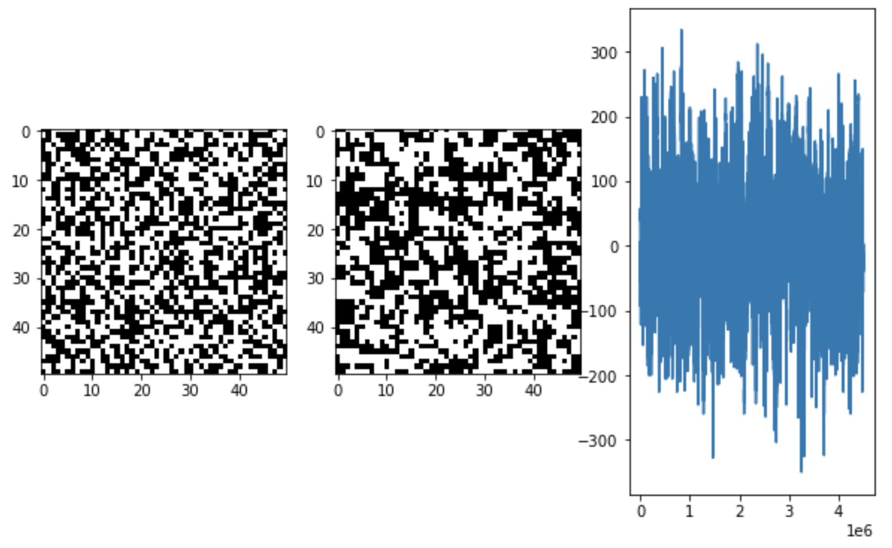

# Ising Model

**Preface**

The Ising model is a model that is used to study the magnetic properties of materials. Specifically, it is used to model ferromagnetism and the random alignment of iron within an electromagnetic field.

**The Magnetic Field**

The model works by starting with a randomly generated square of spin charges (-1 or 1). Initially the charges are so randomly distributed that the net charge is neutral but outside factors can impact this. Mainly the presence of an external field or the temperature of the environment.

**Hamiltonian**

The measurement of any of these changes is measured by the hamiltonian below.

\begin{equation}
\begin{aligned}
    H_j & =-\sum\limits_{<i, j>}J_{i,j}\sigma_i\sigma_j-h\sum\limits_{j}\sigma_j\\
    H_j & =-J\sum\limits_{i}{\sigma_i\sigma_j}-h\sigma_j,
\end{aligned}  
\end{equation}

where $J_{i, j}$ denotes the intensity of the spin-spin interaction between a point and its immediate neighbors; h represents the presence of an external field.

**Processing Changes**

Using the Hamiltonian above, I created a metropoliis algorithm to 'brute-force' inherent randomness by sampling the whole grid multiple times. After selecting our random sample, the program preemptively flips its spin and calculates the energy difference between the initial and the current state. If the current state is better (less energy), than the spin change stays. If not, the sample is randomly chosen to flip or not based on a random number. After sampling the grid thousands of times, the magnetic field begins to unify.

**Changes in External Field**

Increasing the external magnetic field increases the speed at which the simulated field organizes itself. The graph below is a representation of the steady-state magnetization as external field is varied.

As a visual aid to how adding an external field impacts the simulation, I have included a figure below consisting of the initial random configuration (left), the final iteration after 3,000,000 samples (middle) and the steady-state net magnetization (right). This simulation used $h=0.1$ to implement the external field.

**Changes in Temperature**

Even with no external field to instigate an alignment in a random field, ferromagnetic materials are known to exhibit spontaneous magnetization. At lower temperatures, the systems favors unity. Once the temperatures dip below the critical (known as the Curie Temperature $T_c$), this phenomenon is observable.

 Above is a figure representing this phenomenon showing how under a certain temperature, the average magnetization is pushed to extremes (full alignment), whereas beyond this temperature the magnetization is net neutral. The below example is a situation in which the temperature is high so the simulation is unable to reach steady state, even after 4,000,000 iterations.

 

