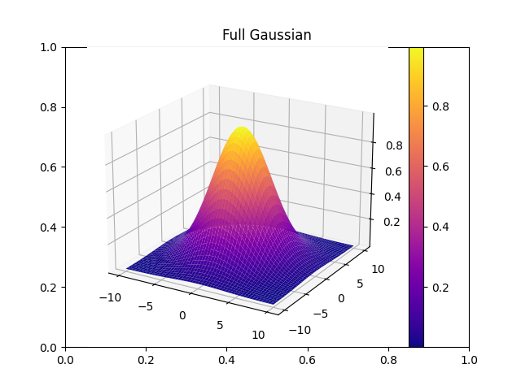
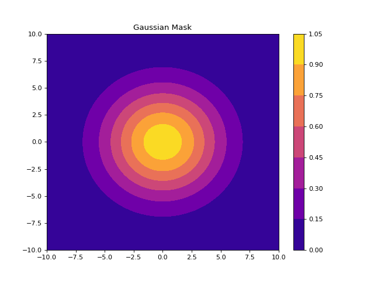
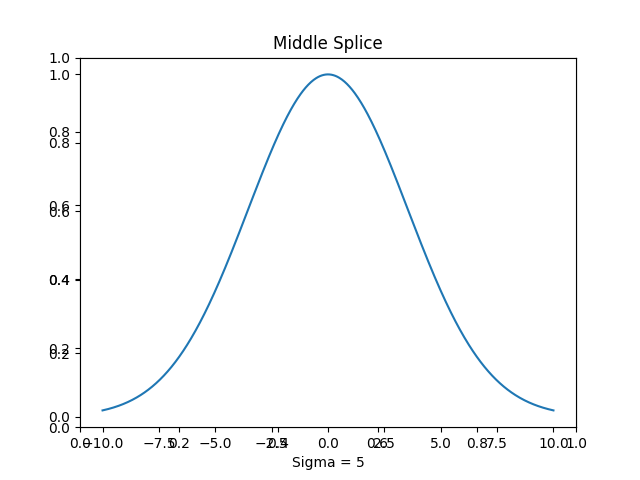

# Phase Mask Creation Using Fourier Analysis

[Github Repository](https://github.com/georgiander/Laser-Manipulation)

**Preface**

This project was the culmination of my work using spatial light modulation (SLM) to create images in the first order diffraction beam of an incoming laser (532nm and 730nm). The purpose of this project was to create a small library in order to interact with the SLM and provide images to be projected.

**Project**

*Initial Imaging*

In order to begin to map phase masks, a clean image of a beam is required from the reference point of the SLM. As SLMs have no camera interface, a fake beam needed to be created to replicate one. First, a gaussian beam would need to be created and placed at the right amplitude and location within an image to accurately map the incoming beam on the SLM. Below is an example of the outputted gaussian 'beams' set to a contour image.

    

        
        
3D Rendering

    

    

        
        
2D Contour Mask

    

    

        
        
1D Splice to show amplitude

    

Using these fake beams and a camera, I was able to manipulate the placement of the beam (or the SLM, in some cases) to the precise location of the true beam. 

*Phase Masks*

By taking into account the beam placement from the initial imaging process and the image to be created, a phase mask can be created. This phase mask is created with the use of a Gerchberg Saxton Algorithm. The purpose of this algorithm is to repeatedly using fourier transforms and forcing the image on top of it by superimposing the correct amplitudes in both the fourier and image planes. By repeating this process, a phase mask is returned.

Above is a visual look at what the GS algorithm does. Below is an example of the whole process starting with an initial image, its phase mask, and what it would look like in the fourier plane of a laser.

*The Animation*

Expanding this idea further than a single image, I created 141 handcrafted frames which were processed by the GS algorithm and played in succession to create a short looping animation.

